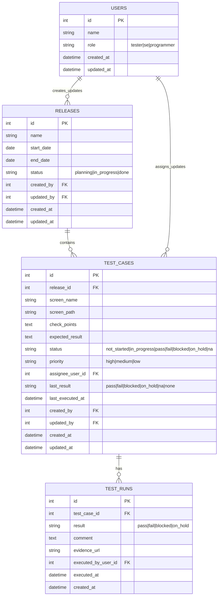

```mermaid
erDiagram
  USERS ||--o{ RELEASES : creates_updates
  RELEASES ||--o{ TEST_CASES : contains
  USERS ||--o{ TEST_CASES : assigns_updates
  TEST_CASES ||--o{ TEST_RUNS : has

  USERS {
    int id PK
    string name
    string role  "tester|se|programmer"
    datetime created_at
    datetime updated_at
  }

  RELEASES {
    int id PK
    string name
    date start_date
    date end_date
    string status "planning|in_progress|done"
    int created_by FK
    int updated_by FK
    datetime created_at
    datetime updated_at
  }

  TEST_CASES {
    int id PK
    int release_id FK
    string screen_name
    string screen_path
    text check_points
    text expected_result
    string status "not_started|in_progress|pass|fail|blocked|on_hold|na"
    string priority "high|medium|low"
    int assignee_user_id FK
    string last_result "pass|fail|blocked|on_hold|na|none"
    datetime last_executed_at
    int created_by FK
    int updated_by FK
    datetime created_at
    datetime updated_at
  }

  TEST_RUNS {
    int id PK
    int test_case_id FK
    string result "pass|fail|blocked|on_hold"
    text comment
    string evidence_url
    int executed_by_user_id FK
    datetime executed_at
    datetime created_at
  }
```
